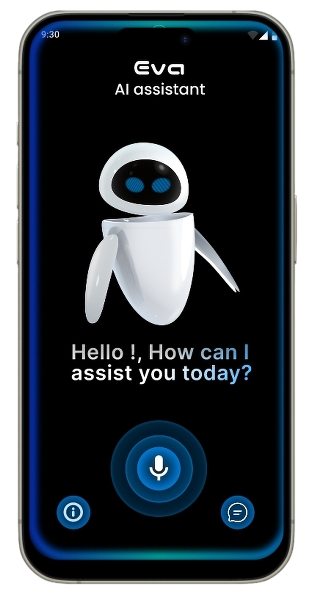
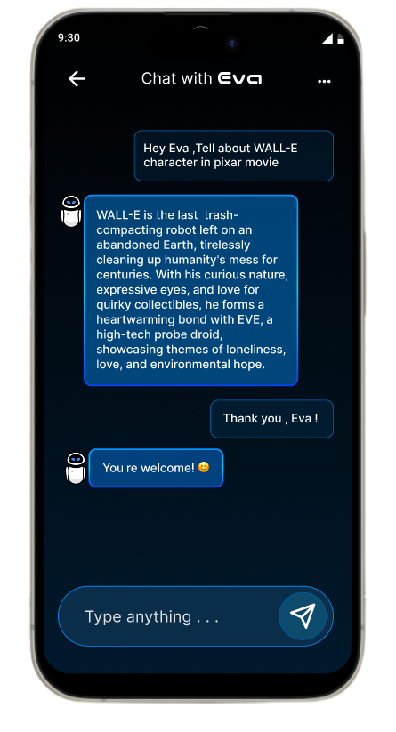
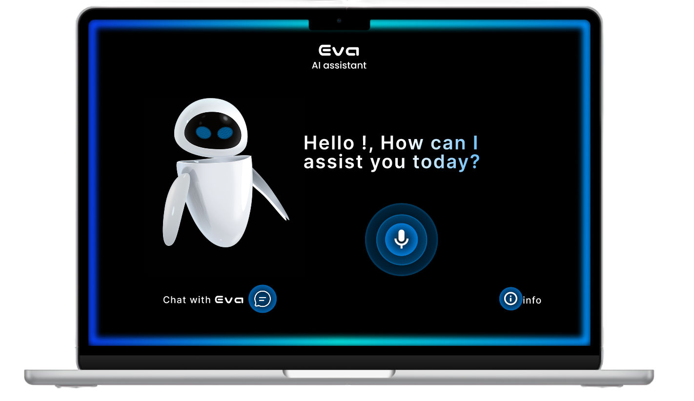

# 🤖 Eva – Personal AI Voice & Chat Assistant

## 🔗 Meet our ***Eva🤖*** : [Eva Ai Assistant](https://eva-ai-assistant.vercel.app/)

**Eva** is your smart, stylish, and conversational personal assistant built with modern web technologies. Designed to interact via **both voice and chat**, Eva makes everyday digital interactions more natural, efficient, and hands-free.

## 🌟 Highlights

- 🎤 **Voice & Chat Interface** – Talk to Eva or type your queries—she listens and responds either way.
- 🧠 **AI-Powered Conversations** – Integrated with cutting-edge AI APIs for smooth, context-aware responses.
- 🖥️ **Built with React.js** – Fast, dynamic, and responsive frontend architecture.
- 💡 **Web Speech API Integration** – Enables real-time voice recognition and speech synthesis.
- 🎨 **Tailwind CSS UI** – A sleek, responsive, and modern design that looks great on all devices.

## 🛠️ Tech Stack
- **Frontend:** React.js
- **Styling:** Tailwind CSS
- **AI Integration:** AI APIs (Gemini Ai)
- **Voice Capabilities:** Web Speech API (Speech Recognition + Speech Synthesis)

## 🎨 Design

## 💻 Preview

## 🖥️ Video Explanation
[**Video Link** 🚀](https://www.linkedin.com/posts/mohanapriyan-m2006_ai-reactjs-tailwindcss-activity-7326215037503557634-xM6L?utm_source=share&utm_medium=member_desktop&rcm=ACoAAEdfjWABL_2j98un4JlBtZDRvHOOIBs2IsE)

_click and watch video_

---

> *Eva isn't just an assistant—she's your digital companion.* ✨
